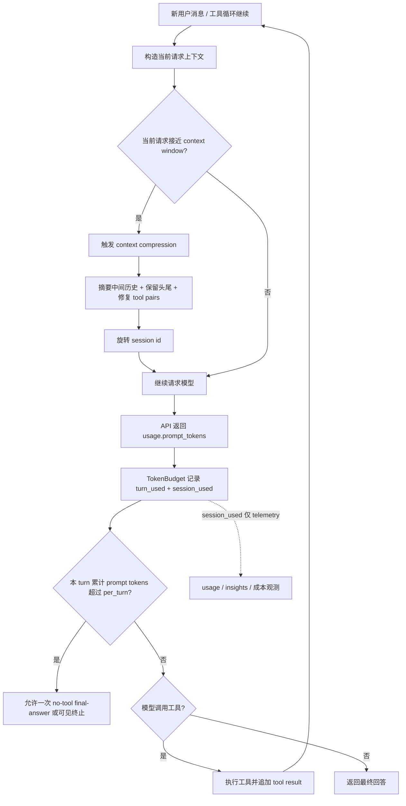
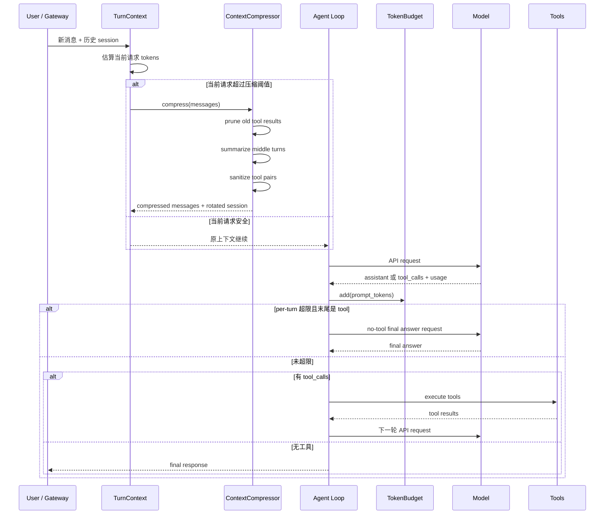
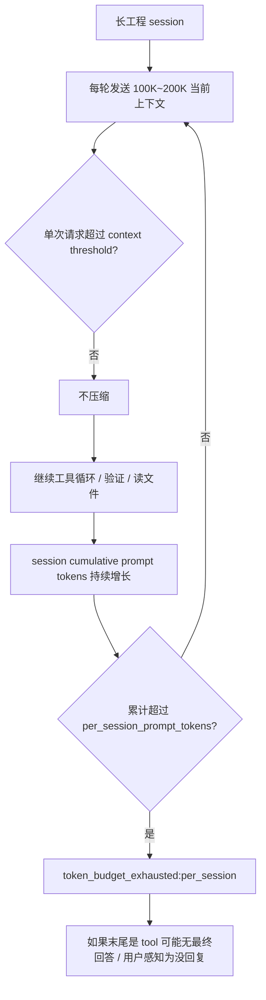
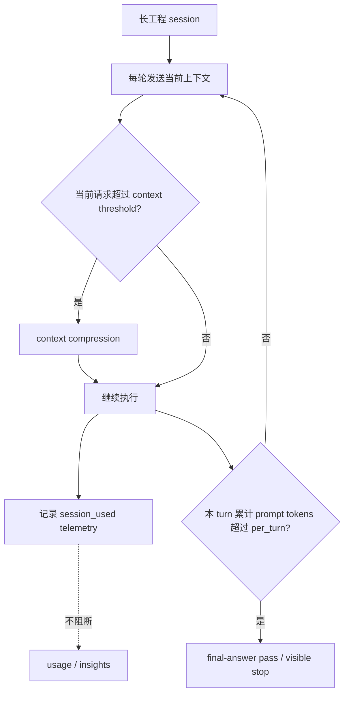

# Token Budget 与上下文压缩优化报告

日期：2026-06-25  
范围：Hermes/Jarvis Agent loop、TokenBudget、Context Compression  
触发事件：Lotus AI Pricing「爆款 / Discover Hot Products」长工程会话出现 `token_budget_exhausted`，用户后续消息无回复。

## 1. 结论

本次问题的根因不是 Feishu 投递失败，也不是模型单次 context window 真正塞满，而是 Hermes 将“session 累计 prompt tokens”当成会话硬熔断条件。对于长工程任务，累计 token 会随着正常有效工作持续增长；它只能代表成本/延迟观测，不代表当前上下文不可用。因此：

- 当前上下文是否要压缩：只看当前请求的 prompt-token 压力、工具输出密度、上下文窗口风险。
- 是否要中止一个 turn：只看单个 turn 内是否重复发送大上下文，即 per-turn runaway guard；当前已放宽到普通模型 10M、expensive 模型 5M。
- session 累计 prompt tokens：只保留为 telemetry/insights，不再冻结有效长会话。

## 2. 事故现象

Lotus 长工程会话在多轮工具调用后静默/无回复。历史证据显示：

- session 累计 API 调用数超过 100 次。
- 工具结果占据主要上下文体积，尤其 `terminal`、`read_file`、`skill_view`、`search_files`。
- 单次请求 input tokens 最高约 217K，低于 gpt-5.5 配置 context window 的压缩阈值。
- session 累计 prompt tokens 超过旧的 `per_session_prompt_tokens=8,000,000`，触发 `token_budget_exhausted:per_session`。

## 3. 原错误模型

旧模型把两个不同维度混在一起：

```text
current_request_prompt_tokens = 本次 API 调用携带的上下文大小
session_cumulative_prompt_tokens = 多次 API 调用 prompt_tokens 的时间累计
```

累计值满足：

```text
session_cumulative_prompt_tokens = Σ current_request_prompt_tokens
```

它不是“当前上下文大小”。它会随着正常有效工作线性增长，因此不适合作为会话健康判断。

## 4. 正确模型



关键边界：

- `ContextCompressor.should_compress()`：当前请求上下文压力。
- `TokenBudget.breach()`：只返回 `per_turn`，不返回 `per_session`。
- `TokenBudget.session_used`：保留给 usage、insights、诊断，不参与 hard stop。

## 5. 本次代码优化

### 5.1 `agent/token_budget.py`

改动：

- 文档语义从“per-turn / per-session circuit breaker”改为“per-turn circuit breaker”。
- `session_used` 继续累计，但只作为 telemetry。
- `breach()` 不再检查 `per_session_limit` / `expensive_per_session_limit`。
- expensive model 只收紧 per-turn cap。

效果：

- 长 session 不会因为累计 token 达到阈值而冻结。
- 同一个 turn 里如果模型陷入工具循环并反复发送大上下文，仍会被 per-turn guard 拦截。

### 5.2 `hermes_cli/config.py`

改动：

- 默认配置注释同步为：`per_session_prompt_tokens` 是 telemetry-only compatibility config，不是 hard stop。
- 避免未来维护者再次把 session 累计 token 当上下文健康信号。

### 5.3 `SELF_ARCHITECTURE.md`

改动：

- 在 Core Agent Loop cheat-sheet 中明确：TokenBudget breach 是 per-turn only。
- 在 Context Compression 章节明确：压缩只依据当前请求 prompt-token pressure，session cumulative prompt tokens 不参与压缩/阻断。

### 5.4 `tests/test_token_budget.py`

改动：

- 更新 per-session 相关测试，断言累计 token 只影响 `session_used`，不会触发 `breach()`。
- 新增 `test_per_session_limit_is_observability_only`。
- 保留 per-turn 熔断测试。

## 6. 验证结果

### 6.1 TokenBudget 与关键 agent loop 回归

命令：

```bash
python -m pytest tests/test_token_budget.py \
  tests/run_agent/test_run_agent.py::TestRunConversation::test_token_budget_after_tool_result_requests_no_tool_final_answer \
  tests/run_agent/test_run_agent.py::TestRunConversation::test_token_budget_final_answer_refuses_new_tool_calls \
  tests/run_agent/test_run_agent.py::TestRunConversation::test_context_compression_triggered \
  -q -o 'addopts='
```

结果：

```text
16 passed, 1 warning in 6.69s
```

### 6.2 压缩相关扩展回归

命令：

```bash
python -m pytest tests/agent/test_context_compressor.py \
  tests/agent/test_compressed_summary_metadata.py \
  tests/agent/test_compressor_assistant_tail_anchor.py \
  tests/agent/test_context_compressor_summary_continuity.py \
  tests/run_agent/test_compression_boundary.py \
  tests/run_agent/test_compression_persistence.py \
  tests/run_agent/test_infinite_compaction_loop.py \
  tests/run_agent/test_1630_context_overflow_loop.py \
  -q -o 'addopts='
```

结果：

```text
163 passed, 1 warning in 10.28s
```

### 6.3 综合定向验证

命令：

```bash
python -m pytest tests/test_token_budget.py \
  tests/agent/test_context_compressor.py \
  tests/agent/test_compressed_summary_metadata.py \
  tests/run_agent/test_run_agent.py::TestRunConversation::test_token_budget_after_tool_result_requests_no_tool_final_answer \
  tests/run_agent/test_run_agent.py::TestRunConversation::test_token_budget_final_answer_refuses_new_tool_calls \
  tests/run_agent/test_run_agent.py::TestRunConversation::test_context_compression_triggered \
  -q -o 'addopts='
```

结果：

```text
116 passed, 1 warning in 8.91s
```

### 6.4 ContextCompressor smoke

脚本构造 120 条 user/assistant/tool 历史消息，模拟大工具输出，mock `_generate_summary()`，直接调用 `compress()`。

结果：

```text
orig_messages 120
compressed_messages 12
orig_chars 239540
compressed_chars 14192
summary_count 1
compression_count 1
last_savings_pct 93.5
first_roles ['user', 'assistant', 'tool', 'user', 'assistant']
last_roles ['assistant', 'tool', 'user', 'assistant', 'tool', 'user', 'assistant', 'tool']
summary_preview Summary: completed earlier steps, preserved key files, tests, decisions.

--- END OF CONTEXT SUMMARY — respond to the me
```

结论：上下文压缩正常工作：message 数下降、字符数下降、summary metadata 存在、compression_count 增加、尾部上下文被保留。

## 7. 正常流程图



## 8. 错误流程图（修复前）



问题点：`F -> G` 把成本累计误当作上下文健康判断。

## 9. 修复后流程图



修复点：`session_used` 只流向观测面；hard stop 只看 per-turn。

## 10. 后续建议

1. 保留 `per_session_prompt_tokens` 配置字段但在 UI/文档标注为 telemetry compatibility，避免破坏老配置。
2. 后续如果要做成本控制，应做 soft warning / usage dashboard / 用户可配置提醒，不要走 agent loop hard stop。
3. 对长工程任务继续优化“工具结果密度”：terminal/read_file/search 输出应优先摘要化和 artifact 化，但触发依据仍应是当前活跃上下文，而不是 session 累计。
4. 对 Feishu/gateway 的异常终止文案继续增强：任何 hard stop 都必须给用户可见解释，不能静默。
